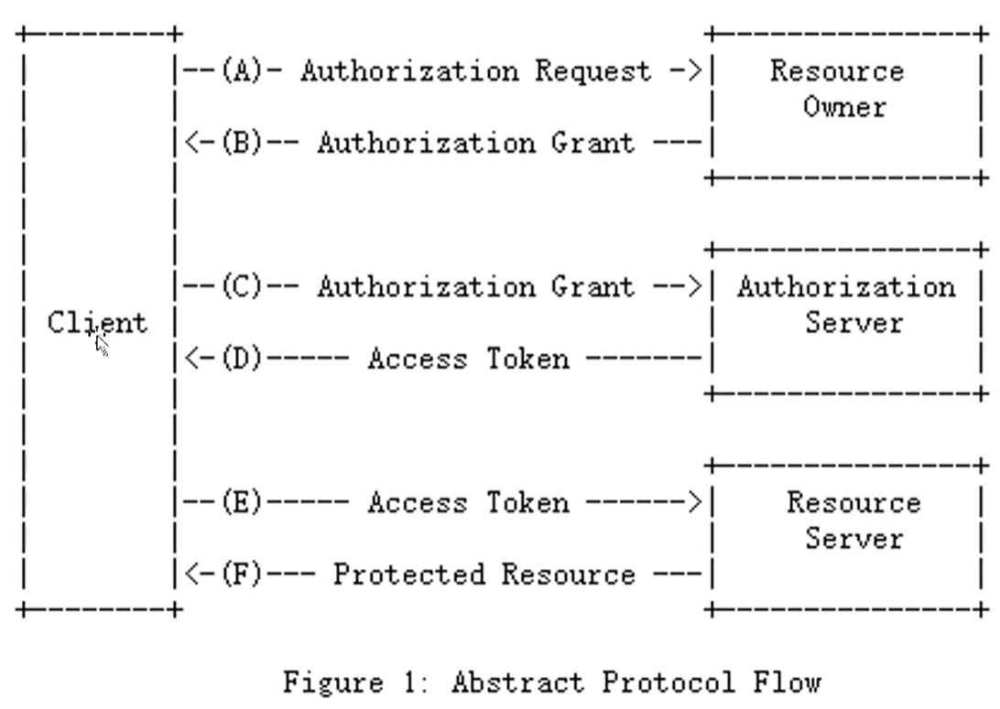
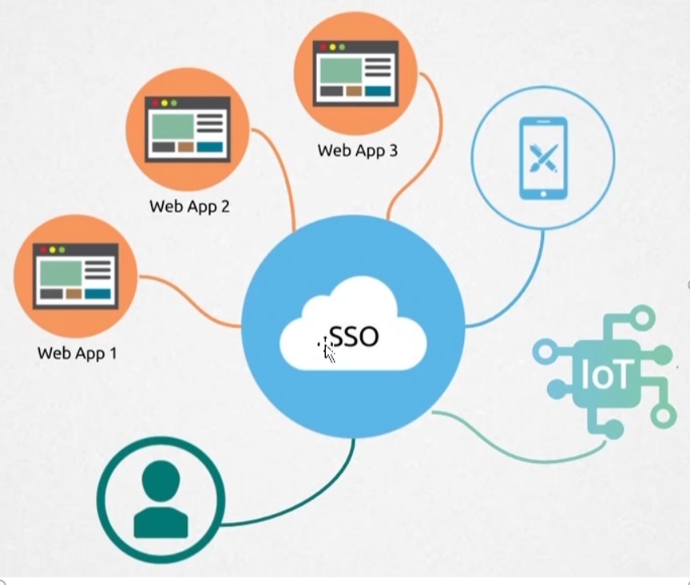

# OAuth2中的4个方

分析下:

- 资源拥有方 user
- 资源方 wx
- 资源请求方 localServer(本地服务)
- 授权方 oauth2(授权服务)

本项目实现这个授权服务

# 流程图

# OAuth2的四种授权流程(grant_type)

OAuth2 就是为了颁发token

授权码(authorization code)

- 用户登录授权，先拿code
- 用code换token

隐藏式(implicit)

- 用户登录授权，不拿code了，直接拿token

密码式(password)

- 用户提前给客户端用户名密码
- 验证客户端，直接用用户名和密码，拿token

客户端凭证(client credentials)

- 验证客户端，直接拿token (可能多个用户使用同一token)

# sso

(OAuth2 可以实现sso)
分离出一个服务去维护一个统一的会话, 大家共享

恰好，OAuth2的authorization_code流程能帮我们实现SSO

